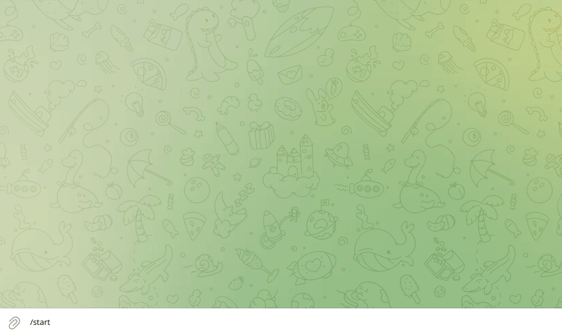

# Бот Python Meetup Bot

Это MVP чат-бота для организации ивентов в телеграм со своей джанго админкой.
<a href="https://ibb.co/f185vVG"></a>

Он умеет показывать программу мероприятия, собирать анкетные данные, собирать вопросы для спикеров и отправлять их им в телеграм, реализован простой алгоритм для желающих познакомиться друг с другом участников мероприятия. 



## Запуск

Python3 должен быть уже установлен.

* Скачайте код
* Установите зависимости  
```pip install -r requirements.txt```
* Запустите бот командой  
```python3 manage.py bot```
* Для доступа к админке  
```python3 manage.py createsuperuser```
```python3 manage.py migrate```
```python3 manage.py runserver```
На команду `/start` должен отреагировать, значит проект развернулся, все ок.

## Переменные окружения

Для корректной работы кода необходимо указать переменные окружения. Для этого создайте файл `.env` рядом с `manage.py` и запишите туда следующие обязательные переменые:

* `TELEGRAM_API_KEY` - Токен ключ бота в Телеграм;
* `DJANGO_SECRET_KEY` - Секретный ключ Django;
* `TG_USER_ID` - чат id для логов в телеграмме
* `TG_TOKEN_LOGGING` - Токен ключ бота в Телеграм для логов;
* `REDIS_HOST` 
* `REDIS_PORT`
* `REDIS_PASS` - данные для доступа к БЗ Redis. Брать в личном кабинете на [сайте](https://redis.io/)
* `DEBUG=TRUE` - включить, выключить режим DEBUG. Подробности в доке [джанго](https://docs.djangoproject.com/en/4.0/ref/settings/)

## Внимание django-admin-shortcuts==2.0

Библиотека имеет конфликт с django версией 4, чтобы все работало необходимо самому поправить библиотеку, как в пул реквесте по [ссылке](https://github.com/alesdotio/django-admin-shortcuts/pull/40/commits/9fa4c1e7349a0da4dcbb77ec3aef19cd0f4be8d5)
